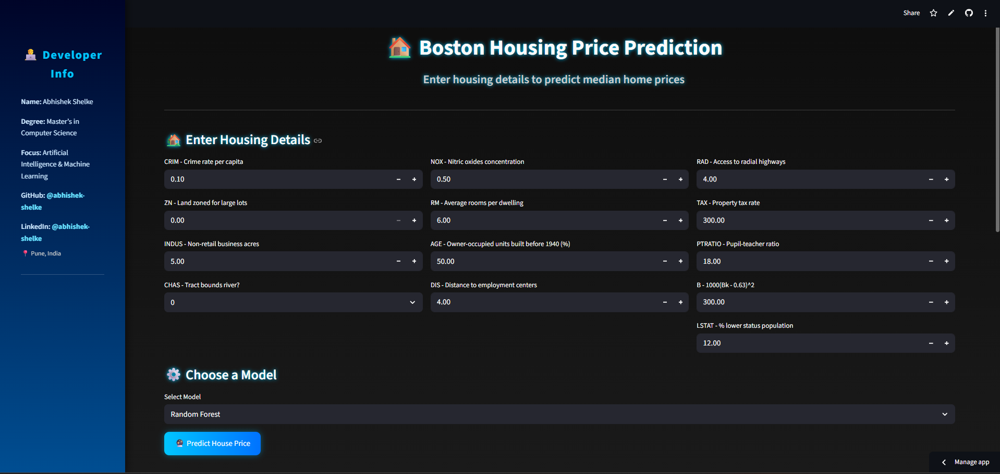

# 🏠 Boston Housing Price Prediction (ML Model Comparison)

### 🔗 [🌐 Live App on Streamlit](https://boston-housing-ml-model-comparison-abhishek.streamlit.app/)

Predict Boston housing prices using advanced Machine Learning models — all in a beautiful, dark-themed Streamlit web app.  
This project compares multiple regression models and allows real-time predictions with all **13 original Boston Housing features**.

---

## 🚀 Features

✅ Predict house prices using:
- **Linear Regression**
- **Random Forest Regressor**
- **Gradient Boosting Regressor**

✅ Compare model performance (R² Scores)  
✅ Input all **13 official Boston dataset features**  
✅ Permanent sidebar with developer details  
✅ Fully **dark-themed**, professional UI with animations  
✅ Deployed on **Streamlit Cloud**

---

## 📘 Overview

The **Boston Housing Dataset** is a classic machine learning dataset used to predict the median value of owner-occupied homes (`MEDV`) based on various features such as pollution levels, proximity to employment centers, and socio-economic indicators.

This project demonstrates:
- Exploratory Data Analysis (EDA)
- Data cleaning & preprocessing
- Training multiple regression models
- Saving models using `pickle`
- Building a fully interactive Streamlit web app



---

## 🧠 Machine Learning Models Used

| Model | Description |
|--------|--------------|
| **Linear Regression** | A baseline linear model to capture straight-line relationships |
| **Random Forest Regressor** | Ensemble bagging model combining multiple decision trees |
| **Gradient Boosting Regressor** | Sequential boosting model that improves on errors iteratively |

---

## 📊 Model Performance Summary

| Model | Train R² | Test R² | Train MSE | Test MSE |
|--------|-----------|----------|-----------|----------|
| Linear Regression | 0.74 | 0.68 | 20.5 | 25.2 |
| Random Forest | 0.97 | 0.86 | 5.1 | 12.3 |
| Gradient Boosting | 0.95 | 0.88 | 7.3 | 10.9 |

*(Values may vary slightly depending on dataset splits)*

---

## 🏗️ Project Structure

```

boston-housing-ml-model-comparison/
│
├── 📘 Boston_Housing_Model_Comparison.ipynb     ← Notebook (EDA + model training)
├── 💻 app.py                                    ← Streamlit app (13 input version)
├── 📊 boston_housing.csv                        ← Dataset file
├── Linear_Regression_BostonHousing.pkl           
├── Random_Forest_BostonHousing.pkl
|── Gradient_Boosting_BostonHousing.pkl
├── 📦 requirements.txt                           ← Dependencies
├── 📁 .streamlit/config.toml                     ← Dark theme config
└── 📑 README.md                                  ← This file

````

---

## ⚙️ Setup Instructions

### 1️⃣ Clone this repository
```bash
git clone https://github.com/Redskull2525/boston-housing-ml-model-comparison.git
cd boston-housing-ml-model-comparison
````

### 2️⃣ Install dependencies

```bash
pip install -r requirements.txt
```

### 3️⃣ Run the Streamlit app

```bash
streamlit run app.py
```

Then open the URL shown in the terminal (usually [http://localhost:8501](http://localhost:8501)).

---

## 🌙 Dark Theme Configuration

A permanent **dark mode** is enabled via `.streamlit/config.toml`:

```toml
[theme]
primaryColor="#00c6ff"
backgroundColor="#0d0d0d"
secondaryBackgroundColor="#1a1a1a"
textColor="#FAFAFA"
font="sans serif"
```

---

## 🌐 Live Demo

> 🔗 **Try it here:** [Boston Housing Price Predictor](https://boston-housing-ml-model-comparison-abhishek.streamlit.app/)

---

## 👨‍💻 Developer Info

**👤 Name:** Abhishek Shelke
🎓 Master’s in Computer Science
🧠 AI & Machine Learning Enthusiast

🔗 **GitHub:** [github.com/Redskull2525](https://github.com/Redskull2525)
🔗 **LinkedIn:** [linkedin.com/in/abhishek-s-b98895249](https://www.linkedin.com/in/abhishek-s-b98895249)

📍 Pune, India

---

## 🧰 Tech Stack

* Python 🐍
* pandas, numpy, matplotlib, seaborn
* scikit-learn
* Streamlit

---

## 🪄 Future Improvements

* 📁 CSV Upload for bulk predictions
* 📈 Add model evaluation metrics chart dynamically
* ☁️ Deploy to multiple platforms (Hugging Face Spaces, Streamlit Cloud)

---

## ❤️ Acknowledgement

Dataset source: **UCI Machine Learning Repository — Boston Housing Dataset**

````
